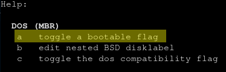

Recently, a couple of my colleagues have bought second-hand 
[Thinkpad X230's](https://www.lenovo.com/gb/en/laptops/thinkpad/x-series/x230/) and installed [Arch Linux](https://www.archlinux.org/) 
on them. They've had nothing but great things to say about it. A relatively cheap laptop, that's also incredibly performant 
for development purposes - perfect!

I've heard a lot about Arch in the past, particularly around how troublesome it can be to setup. I thought I'd find out for
myself. I didn't buy a Thinkpad, but I had a spare [MSI GE60](https://www.msi.com/Laptop/GE60-2OE/Specification) sat around from 
when I went to University, with an unused 1TB hard drive. So I set myself to work.

## Laying the foundations

My MSI GE60 currently has Windows 10 on a 250GB SSD. I replaced the optical disc drive with a [hard drive caddy](https://www.amazon.co.uk/Qumox-Caddy-Universal-External-Enclosure/dp/B00C94G7Q6) and repurposed
a 1TB hybrid hard drive/SSD into it. This was the foundation that I'll install Arch Linux on.

## A different experience

Arch Linux has an interesting install process. Whilst distro's like [Ubuntu](https://ubuntu.com/) can be installed through a wizard via booting
a USB drive or a disc drive, Arch Linux doesn't (by default at least) have the same experience.

Rather, you boot into a live environment on a CD or USB, and are expected to mount your disks manually, run some [install 
commands](https://wiki.archlinux.org/index.php/installation_guide) to copy across the Arch distro onto your hard drive, then install your own bootloader, before finally booting the
hard drive into your new operating system.

I've used Linux off-and-on for a few years, but rarely had to deal with the likes of preparing drives via `fdisk`, so this
was an interesting learning experience.

## What I got wrong

Needless to say, I failed a couple of times.

### Forgetting to mark the root device as bootable

The first issue I had was forgetting to makr the root device as bootable. Formatting via `fdisk` went fine by following
the [Arch Linux install instructions](https://wiki.archlinux.org/index.php/installation_guide). I expected to run into issues given that my laptop doesn't have EFI, but uses old-school
BIOS. This never happened, and configuring for MBR worked just fine.

What I _did_ get wrong, was forgetting to mark the root device as bootable.


See that little asterisk in the Boot column for `/dev/sdb1`? That means the drive is marked as bootable.

I forgot to set this when I created the partition, so by the time I got around to installing [GRUB as my bootloader](https://www.gnu.org/software/grub/),
it had no idea what to try and boot. Don't forget to mark your root device as bootable, by enabling the boot flag! 
This is achieved by using the `a` command in `fdisk`:



### Forgetting to install the network manager utilities before booting

One of the things you do as part of the Arch Linux install experience is to connect to your internet while
booting into the live USB/CD environment. Having installed all the bits I (thought I) needed, I then booted onto the hard drive
(_not the live CD_), only to find my wifi wasn't connected.

No worries, I guess I can just run a `wpa_supplicant` command to configure my wireless adapter as I did before.

That's worked okay, so it's time to get an IP address from my router. To do that, I run `dhcpcd wlan0`:

```
$ dhcpcd wlan0
dhcpcd: command not found
```

Oh dear. Turns out this isn't installed by default, and without internet I can't install it!

Lesson learned: make sure to install all required network management utilities before you exit out of the live CD/USB environment!

## Finally up and running

After working around these issues, and fixing the odd issue with the GRUB bootloader, I'm happy to say that I'm
writing this blog on my MSI GE60 running Arch Linux.

So far, I've found it a wonderful experience. It's nice to not have any of the bloatware auto-installed from
distro's like Ubuntu.

I'm currently using the [GNOME desktop environment](https://www.gnome.org/), which seems to be working pretty well. I find it quite 
familiar, having used the [GNOME-classic shell in Ubuntu](https://www.omgubuntu.co.uk/2019/06/enable-gnome-classic-mode-ubuntu) previously.

Going forwards, I'm hoping to use Arch as my default Linux distro. Sure, it's a bit more cumbersome to install
than something like Ubuntu, but the control you have over your environment is worth the effort.